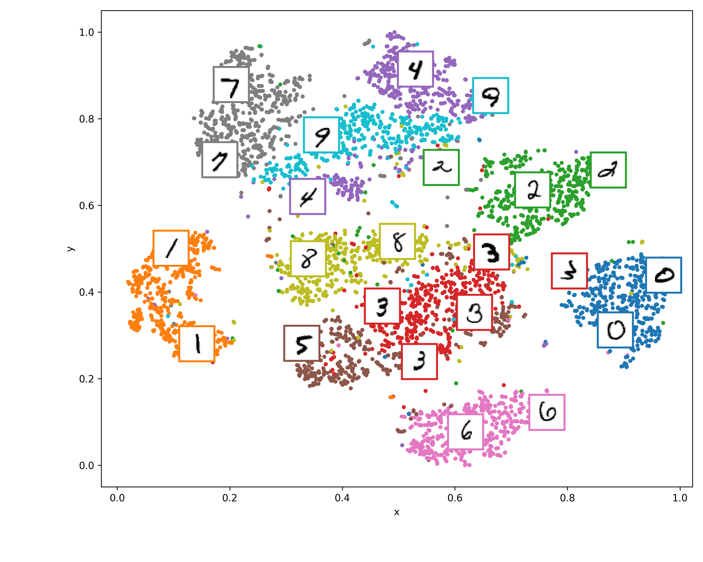
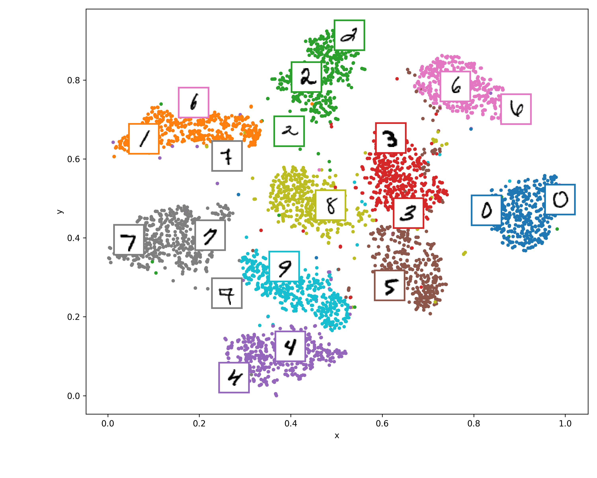
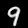
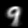

# Generative Models

In short, generative models belong to a class of statistical models that are capable of generating new instances based on a dataset. Typically, these models are utilized in unsupervised learning.

Formally, we can think of a dataset as a sequence of instances $x_1, x_2, ..., x_n$ from a data probability distribution $p(x)$. In the example image below, the blue region represents the part of the image space that contains real images with a high probability (above some threshold), while the black dots indicate our data points (each representing an image in our dataset).

    

We can define our generative model as a probability distribution with $\theta$ parameters, denoted as $\hat p_{\theta}(x)$. It's important to note that we define this distribution using points from a Gaussian unit. Therefore, we need to find $\theta$ parameters that satisfy our requirements: generating new data $x'$ consistently.

In this context, we will be creating various generative models and exploring both experimentation and theory. Let's begin by discussing the first architecture that we will be constructing.

## Autoencoders

This architecture is very important to us, because autoencoders are a base for some popular generative models. Autoencoders have power to compress data and reconstruct data. Basicaly, this is very interesting because, first application can be compress data and you can spend less memory for any application (yay!). But autoencoder can be much more! Let's check this out and see architecture below:

    

In here, we can see architecture and loss function that we must to use. This loss is called by "Reconstruction Loss", because when system minimizes this, we can to turn output aproximates by input. 

$$\text{Reconstruction Loss} = \text{MSE}(x, \hat x)$$

Before we in fact construct some generative architecture, lets build an autoencoder and check some theory subjects! Spoiler: You will learn about **latent space** (Latent space is a little bit abstact, think about him like a something in Matrix)

### Visualizing Reconstruction

After training, we can see reconstruction loss and visualize some images. In this case, we will use MNIST dataset. Let's check this out!

    

For now, it's not very interesting. But, we can see some interesting things in latent space. Let's check this out!

### Visualizing latent space

Let's analyze this architecture. If you've noticed, the $z$ variable in the middle of the autoencoder are the input compressed data. Here, we can identify two significant aspects: data compression and dimensionality reduction (similar to PCA). 

    

Look at this! In the **latent space** some semantic properties is conserved. Lets think about this using some cases:

- If you analyzes the number 3 cluster, you will note him closer to 8. Its happen because *3* shape is very similar to *8* if you slice him at the vertical axis. 
- The same ideia can be apply to *4* shape and *9* shape. Note both cluster are closer!

Some semantic in this case are very similar to embeddings semantics: $$f(Queen) - f(King) = f(Girl) - f(boy)$$

## Convolutional Autoencoders

We can apply convolutional layers in autoencoders. This is very interesting because we can use this architecture in images. Let's check this out!

    

### Visualizing Reconstruction

    

### Visualizing latent space

    

Note the improve of quality! But we need to take care about the size of neural network. In many cases of Neural Network is pretty complex the system learn indentity function, and its not cool! Because we want Neural network learns deep patterns about dataset and not inditity functions!

## Divergence KL

In here, we will discuss about Kullback-Leibler Divergence. This equation works like a regularization and your principal role is aproximates distributions. In this case, we will use the following dicrete form:

$$D_{KL}(P \parallel Q) = \sum_{i} P(i) \cdot \log\left(\frac{P(i)}{Q(i)}\right)$$

After some math, we can compute to variational encoder and use in this form:

$$D_{KL}(Q(z|X) \parallel P(z)) = \frac{1}{2} \sum_{j=1}^{J} \left( 1 + \log(\sigma_j^2) - \mu_j^2 - \sigma_j^2 \right)$$

## Variational Autoencoders

    

## Transition between two classes

Now, we have all interpolated images between 0->1, 1->2, 2->3... Remember: We calculate centroids for each class and formulate equation of a straight line,

$$\vec r(d) = \vec o + d \hat t$$

In first transition, we use $\vec o = \vec c(0)$ and $\hat t = \frac{\vec c(1) - \vec c(0)}{||\vec c(1) - \vec c(0)||_2}$, where $\vec c(x)$ is the centroid of the number $x$. Then, we can see the gif bellow:

<!--  -->

    

This gif show us a beautiful animation about interpolate images that not in original dataset.

## Quality Transition

Another thing we need to discuss about multi-stage VAE is: There is difference in transition between two architecture?

Let's see and compare!

    

    

